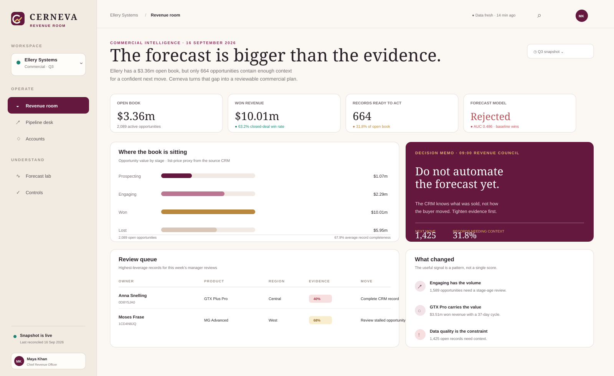
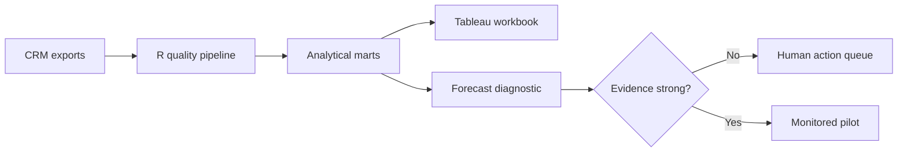

<p align="center">
  
</p>

<p align="center"><strong>Know what the number can carry.</strong></p>

Cerneva is a decision-first revenue operating room for a fictional B2B technology company. It uses R, SQL, statistics and Tableau-ready outputs to answer the question a CRO actually has to answer on Monday morning: **which parts of the number are defensible, which deals need a human conversation, and what evidence is missing before prediction is safe?**



## The revenue-council moment

Ellery Systems has a healthy-looking historical win rate and a busy open pipeline. The problem is that the CRM records outcomes better than it records buyer movement. Cerneva therefore refuses to manufacture a forecast. It turns the evidence gap into a controlled operating plan:

```text
Open book → evidence coverage → manager queue → model challenge → next data requirement
```

The product layer in [`web/`](web/README.md) makes that storyline tangible as a warm, editorial Revenue Room for a CRO or RevOps lead. The analysis, Tableau workbook and SQL model remain the source of truth beneath it.

## The decision, not just the dashboard

| Evidence | Result | Commercial implication |
|---|---:|---|
| Won revenue | **$10.01m** | Premium product lines require separate value planning |
| Closed-deal win rate | **63.2%** | A useful baseline, not a personalised probability |
| Median sales cycle | **45 days** | Stalled Engaging deals need a defined review threshold |
| Open opportunities | **2,089** | A ranked action queue is more useful than another KPI tile |
| Chronological holdout AUC | **0.486** | Current CRM fields do not support automated win prediction |
| Model Brier score vs baseline | **0.242 vs 0.241** | The model is rejected rather than presented as false certainty |

The most important finding is negative: owner, product, region and basic account attributes do not predict outcomes better than the historical win rate. Cerneva therefore recommends collecting stage history, sales activities, stakeholder coverage and buyer-intent signals before a forecast model is operationalised.

That is the deliberate product choice: when the evidence is weak, narrow the question and improve the record rather than presenting a confident-looking probability.

## What this project demonstrates

- **R:** reproducible ingestion, cleaning, joins, feature engineering, grouped analysis, visualisation and logistic regression using base R
- **Statistics:** chronological validation, ROC AUC, Brier score, log loss, calibration and empirical-Bayes shrinkage for fair agent comparisons
- **Tableau:** a packaged workbook, calculated KPIs, executive dashboard design and decision-oriented storytelling
- **SQL:** PostgreSQL staging, dimensional modelling, CTEs, window functions, percentiles and data-quality controls
- **Commercial thinking:** pipeline hygiene, territory analysis, product mix, sales-cycle analysis and action prioritisation
- **Governance:** automated tests and an explicit rule that prevents a weak model from reaching operations

## Architecture



## Repository map

| Path | Purpose |
|---|---|
| `R/run_pipeline.R` | Complete, dependency-free R analysis pipeline |
| `tests/run_tests.R` | Executable output and business-rule tests |
| `sql/` | PostgreSQL model and portfolio analysis queries |
| `tableau/Cerneva.twbx` | Packaged Tableau workbook with its CSV data |
| `data/raw/` | Original CRM source tables |
| `data/processed/` | Tableau-ready deal grain and action queue |
| `outputs/tables/` | Auditable summaries, diagnostics and model evidence |
| `docs/executive-brief.md` | One-page recommendation for sales leadership |
| `docs/methodology.md` | Assumptions, validation design and limitations |
| `web/` | Product-facing Revenue Room with pipeline, accounts, forecast-lab and controls views |

## Reproduce the analysis

The analytical pipeline deliberately uses base R so it can run without package installation.

```bash
Rscript R/run_pipeline.R
Rscript tests/run_tests.R
python tableau/build_workbook.py
```

The Tableau builder packages `Cerneva.twb` and the processed deal file into `Cerneva.twbx`. Tableau Desktop or Tableau Public is still required to open and publish the workbook.

To review the product surface locally:

```bash
python -m http.server 8000
```

Then open `http://localhost:8000/web/`.

## Data

The source is the public **CRM Sales Opportunities** practice dataset from [Maven Analytics Data Playground](https://mavenanalytics.io/data-playground). It represents a fictional computer-hardware sales organisation and contains 8,800 opportunities across products, accounts, agents and regions. See [data/README.md](data/README.md) for provenance and field-level notes.

## Limits

- The dataset is fictional and covers one historical period.
- It has no activity log, stage-transition history, decision-maker coverage, competitor detail or buyer-intent signal.
- The model is diagnostic, not causal, and is intentionally not operationalised.
- The Tableau package is source-controlled and structurally validated here; final pixel-level publishing requires Tableau Desktop/Public.

## Interview version

> I built Cerneva to test whether a CRM could support reliable win forecasting. I created a reproducible R pipeline and SQL analytical layer, then evaluated a logistic model on a chronological holdout. It performed worse than the historical-rate baseline, so I did not disguise that result. I converted the project into a governed commercial action system: it ranks incomplete or stalled pipeline records, explains product and territory performance, and specifies the behavioural data needed before predictive scoring would be trustworthy.
